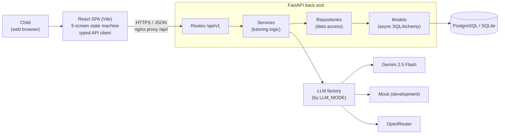
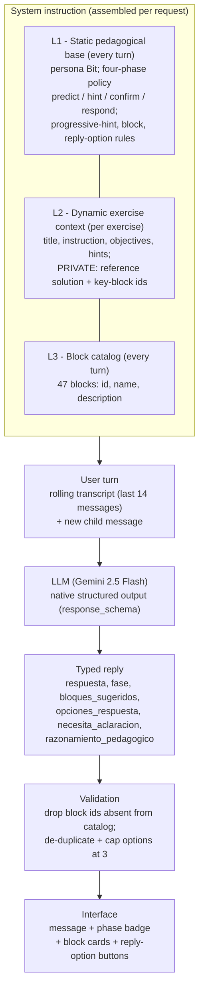
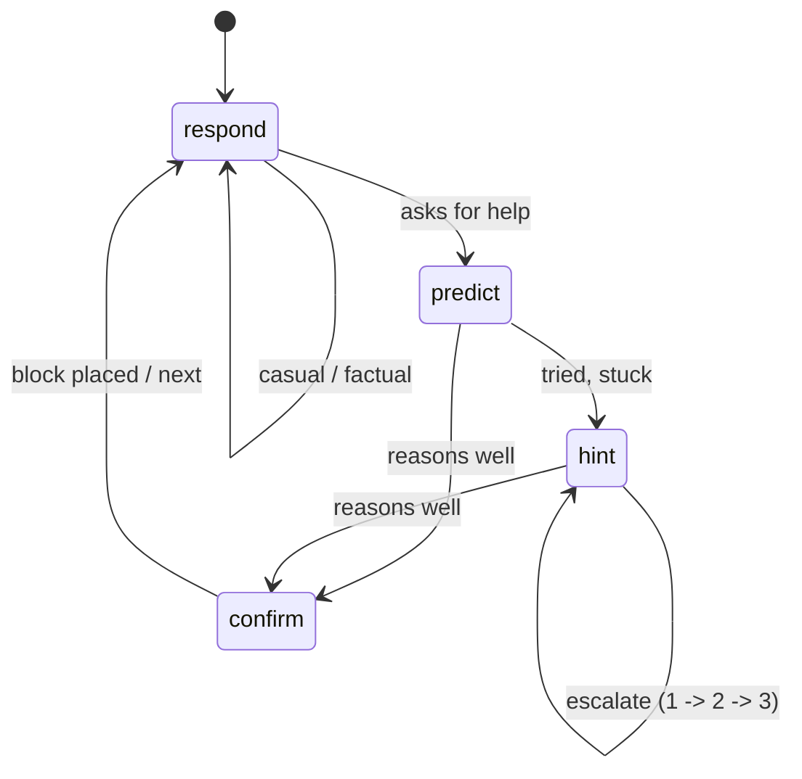
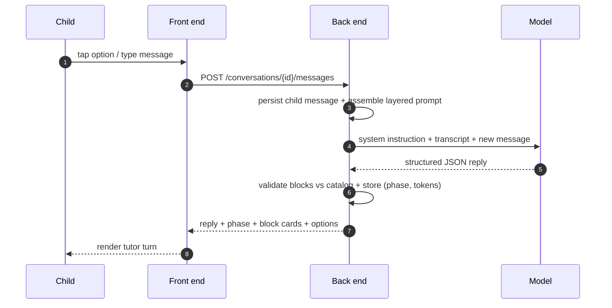

# Diagramas Mermaid — CreaBits Tutor (System Design & Prompt Composition)

Fuente Mermaid de las cuatro figuras del `.tex`. Pégalo en cualquier visor Mermaid
(mermaid.live, GitHub, Notion, VS Code) para verlo o exportarlo a PNG/SVG.
Las mismas figuras están implementadas en TikZ dentro de `conference_101719 (1).tex`.

---

## Fig. 1 — Runtime architecture (`fig:arch`)

---

## Fig. 2 — Prompt composition and reply flow (`fig:prompt`)

---

## Fig. 3 — Interaction phases (`fig:phases`)

---

## Fig. 4 — Message exchange for one turn (`fig:sequence`)

